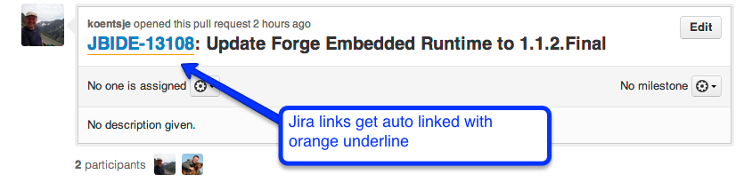

Autolink for JBoss
==================

Simple userscript to enable automatic linking of email, twitter, plain text urls and more importantly JBoss jira links.

This allows you to just refer to Jira bugid's and not full urls in things like Github, like below:

How to install
==============

This is an userscript so any form of Greasemonkey browser variation should work.
Generic instructions for installing userscripts can be found at: https://github.com/p2k/GLaDOS-Enhancer-Plus/wiki/Installing-Userscripts

What I currently use is Chrome and here the steps are:

   1) Download https://github.com/maxandersen/autolinkjboss/raw/master/autolinkjboss.user.js
   
   2) Open Chrome Extension Page (chrome://chrome/extensions/) via Window -> Extensions.

   3) Drag autolinkjboss.userscript.js to this page

   4) Approve the dialog 

   5) Done!

Got instructions for another browser or want to improve/extend the list of jira's it supports fork this repo and send a pullrequest :)
